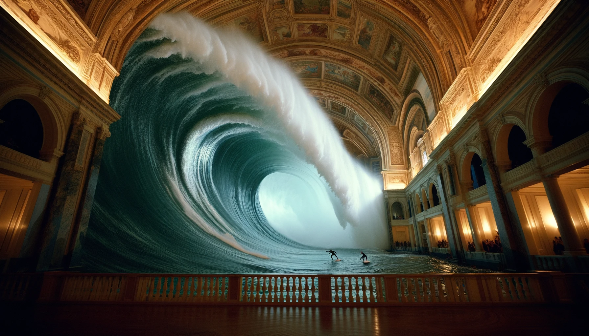
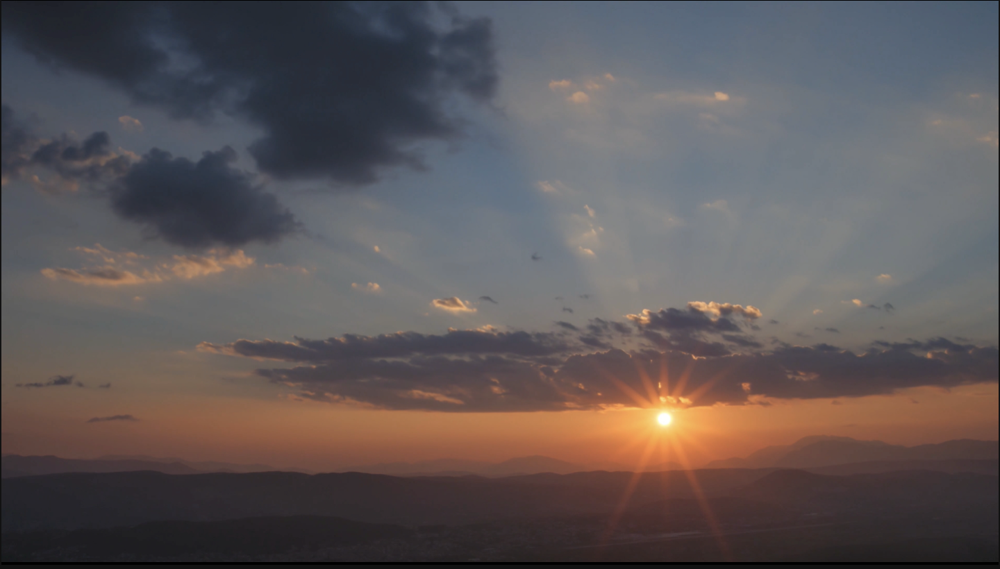
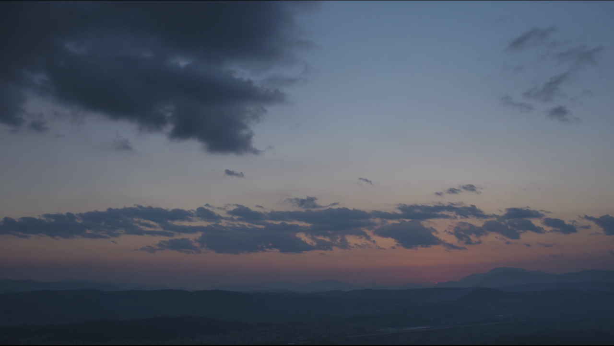

# hpcAI/Open-Sora训练与推理支持
## 1. 简介

[hpcAI/Open-Sora](https://github.com/hpcAI/Open-Sora)为Sora复现版本之一, 其支持不同时长和分辨率的视频生成，并提供模型训练与多任务推理，包括图生视频，视频拼接，视频编辑。

## 2. 环境准备

通过 `git clone` 命令拉取 PaddleMIX 源码，并安装ppdiffusers以及必要的依赖库。请确保你的 PaddlePaddle 框架版本在 2.6.0 之后，PaddlePaddle 框架安装可参考 [飞桨官网-安装](https://www.paddlepaddle.org.cn/install/quick?docurl=/documentation/docs/zh/install/pip/linux-pip.html)。

```bash
# 克隆 PaddleMIX 仓库
git clone https://github.com/PaddlePaddle/PaddleMIX

# 安装2.6.1版本的paddlepaddle-gpu，当前我们选择了cuda12.0的版本，可以查看 https://www.paddlepaddle.org.cn/ 寻找自己适合的版本
python -m pip install paddlepaddle-gpu==2.6.1.post120 -f https://www.paddlepaddle.org.cn/whl/linux/mkl/avx/stable.html

# 进入ppdiffusers目录
cd PaddleMIX/ppdiffusers

# 安装ppdiffusers，若提示权限不够，请在最后增加 --user 选项
pip install -e .

# 进入Open-Sora目录
cd examples/Open-Sora/

# 安装其他所需的依赖, 若提示权限不够，请在最后增加 --user 选项
pip install -r requirements.txt
```

## 3. 模型训练
### 3.1 训练样本数据准备
在该示例中，提供了少量训练样本用于跑通Open-Sora训练流程，可通过以下方式进行下载，也可根据[hpcaitech/Open-Sora](https://github.com/hpcaitech/Open-Sora/blob/main/docs/data_processing.md)自行准备训练数据。
```bash
# Open-Sora训练样本数据下载
wget https://bj.bcebos.com/paddlenlp/models/community/tsaiyue/OpenSoraData/OpenSoraData.tar.gz

# 文件解压
tar -xzvf OpenSoraData.tar.gz
```

### 3.2 单机多卡训练
训练脚本基于 paddlenlp.trainer 实现，可通过 `--gpus` 指定训练使用的GPU卡号，在多卡环境上支持开启分组切片技术`--sharding`以降低显存占用。在NVIDIA 32G V100的算力条件下，需通过减小模型规模(如将模型层数[self.depth](https://github.com/PaddlePaddle/PaddleMIX/blob/develop/ppdiffusers/examples/Open-Sora/models/stdit/stdit2.py#L253)减小为1)，以降低显存占用，从而实现训练流程的跑通。
```bash
ppdiffusers_path=PaddleMIX/ppdiffusers
export PYTHONPATH=$ppdiffusers_path:$PYTHONPATH
python -u -m paddle.distributed.launch --gpus "0,1,2,3" scripts/trainer_opensora.py \
    --do_train \
    --output_dir ./exp_output \
    --save_strategy 'steps' \
    --save_total_limit 2 \
    --save_steps 2000 \
    --per_device_train_batch_size 1 \
    --gradient_accumulation_steps 1 \
    --learning_rate 2.0e-5 \
    --max_steps 30000 \
    --seed 42 \
    --sharding "stage1" \
    --report_to all \
    --fp16 True \
    --fp16_opt_level O1
```
训练流程相关参数详见 [paddlenlp.trainer](https://github.com/PaddlePaddle/PaddleNLP/blob/a5f69e4543a5371ceb28106b7aa2ea93208620b9/paddlenlp/trainer/training_args.py)，模型与数据相关参数详见 `trainer/trainer_args.py`。开发者可以使用默认参数进行训练，也可以根据需要修改参数。

## 4. 前向推理
### 4.1 Text to video
运行以下命令，指定生成视频的帧数、分辨率以及提示词进行视频生成(推理相关参数设置详见`./utils/config_utils.py`)，以下例子提示词可从 `assets/texts`获取，可根据算力条件以生成更长分辨率更大的视频：
```bash
ppdiffusers_path=PaddleMIX/ppdiffusers
export PYTHONPATH=$ppdiffusers_path:$PYTHONPATH
python scripts/inference.py --prompt "A beautiful sunset over the city" --num-frames 16 --image-size 256 256
```
生成效果如下:
| **16×280×280**     | **16×224×400**        | **16×400×224**      |
| ------------------------------------------------------------------------------------------------------------------------------------------------------ | ------------------------------------------------------------------------------------------------------------------------------------------------------ | --------------------------------------------------------------------------------------------------------------------------------------------------------- |
|  |  |  |
| A soaring drone footage captures the majestic beauty of a coastal cliff, its red and yellow [...]        | The vibrant beauty of a sunflower field. The sunflowers, with their bright yellow petals. [...]    | A majestic beauty of a waterfall cascading down a cliff into a serene lake. The waterfall, with its powerful flow [...]       |

### 4.2 Image as condition

运行以下命令，以图像作为条件进行视频生成：
```bash
ppdiffusers_path=PaddleMIX/ppdiffusers
export PYTHONPATH=$ppdiffusers_path:$PYTHONPATH
python scripts/inference-long.py --num-frames 20 --image-size 224 300 --sample-name image-cond --prompt 'A breathtaking sunrise scene.{"reference_path": "assets/images/condition/wave.png","mask_strategy": "0"}'
```
生成效果如下:
| **Prompts**     | **Image as condition**        | **20×224×300**      |
| ------------------------------------------------------------------------------------------------------------------------------------------------------ | ------------------------------------------------------------------------------------------------------------------------------------------------------ | --------------------------------------------------------------------------------------------------------------------------------------------------------- |
| A breathtaking sunrise scene. |  |  |

### 4.3 Video connecting

运行以下命令，将首尾帧图像进行拼接，以获取对应视频：
```bash
ppdiffusers_path=PaddleMIX/ppdiffusers
export PYTHONPATH=$ppdiffusers_path:$PYTHONPATH
python scripts/inference-long.py --num-frames 18 --image-size 224 300 --sample-name connect --prompt 'A breathtaking sunrise scene.{"reference_path": "assets/images/condition/sunset1.png;assets/images/condition/sunset2.png","mask_strategy": "0;0,1,0,-1,1"}'
```
生成效果如下:
| **Prompts**     | **First frame**        | **Last frame**        |  18×224×300      |
| ------------------------------------------------------------------------------------------------------------------------------------------------------ |------------------------------------------------------------------------------------------------------------------------------------------------------ | ------------------------------------------------------------------------------------------------------------------------------------------------------ | --------------------------------------------------------------------------------------------------------------------------------------------------------- |
| A breathtaking sunrise scene. |  |  | |


### 4.4  Video extending and editting
此外支持以视频作为条件进行视频生成，包括视频扩展和视频编辑，运行脚本如下：
```bash
ppdiffusers_path=PaddleMIX/ppdiffusers
export PYTHONPATH=$ppdiffusers_path:$PYTHONPATH
# video extending
python scripts/inference-long.py --num-frames 12 --image-size 240 240 --sample-name video_extend  --prompt 'A car driving on the ocean.{"reference_path": "./assets/videos/d0_proc.mp4","mask_strategy": "0,0,0,-6,6"}'

# video editting
python scripts/inference-long.py --num-frames 7 --image-size 256 256 --sample-name edit --prompt 'A cyberpunk-style car at New York city.{"reference_path": "./assets/videos/d0_proc.mp4","mask_strategy": "0,0,0,0,7,0.4"}'
```


**___Note: 多任务推理相关配置和原理详见[hpcAI/Open-Sora](https://github.com/hpcaitech/Open-Sora/blob/main/docs/config.md#advanced-inference-config)。___**

## 5. 参考资料
- [Open-Sora](https://github.com/hpcAI/Open-Sora)
